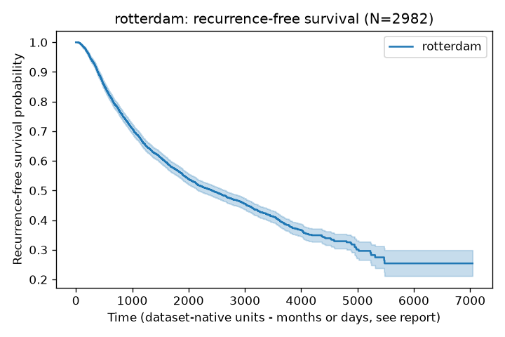
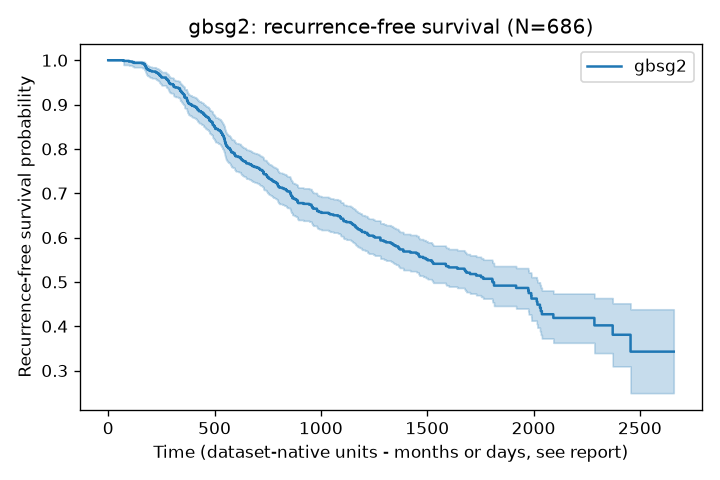
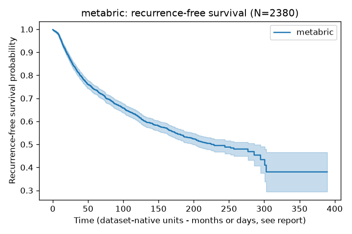
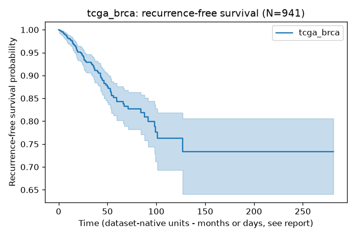
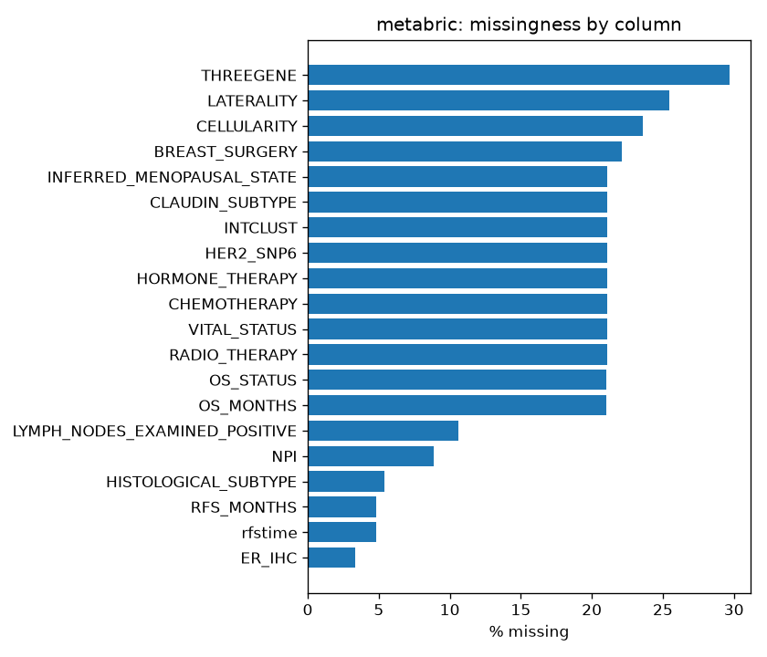
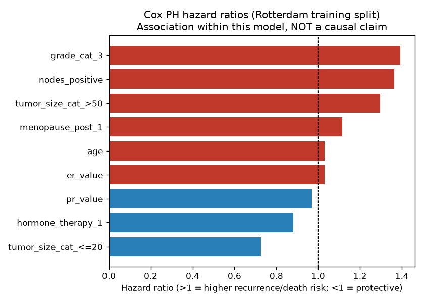
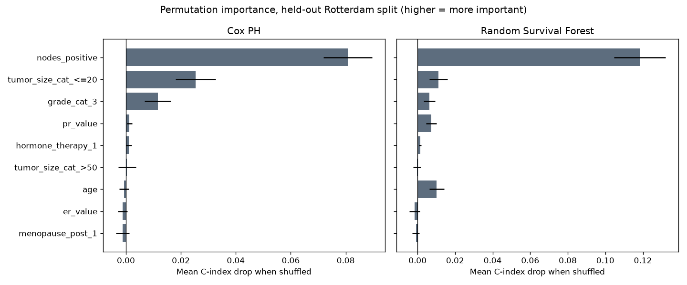

# Breast Cancer Recurrence-Free Survival Prediction: A Real-Data, Multi-Cohort External Validation Study

**Research program status:** Stages 0–16 complete. Full stage-by-stage
record: `research/RESEARCH_STATE.md`. Decision log: `research/DECISIONS.md`.
Compiled 2026-09-18.

---

## Abstract

**Background.** Machine learning models for breast cancer recurrence
prediction are rarely validated across more than one institution or
cohort, and studies claiming to "predict" recurrence frequently instead
detect recurrence already documented in retrospective records — a
distinction that matters for clinical utility but is often not made
explicit.

**Objective.** To develop and externally validate a recurrence-free
survival prediction model for breast cancer using exclusively real,
publicly accessible patient-level data, and to determine empirically
whether model complexity beyond classical survival regression is
justified for this problem.

**Methods.** We trained Cox proportional hazards, elastic-net Cox, random
survival forest, and gradient boosting survival models on the Rotterdam
tumor bank cohort (N=2,982) and externally validated on the GBSG2 cohort
(N=686) — a train/external-test pairing with precedent in the
biostatistics literature. Two further independent real cohorts, METABRIC
(N=1,873) and TCGA-BRCA (N=799), were used as additional within-cohort
cross-checks. A harmonized 8-feature schema was constructed across
cohorts with differing native variable coding, with every mapping
decision documented. Explainability (hazard ratios, permutation
importance) and subgroup robustness analyses were performed on the
selected primary model.

**Results.** External validation (Rotterdam→GBSG2) concordance index was
0.654 for Cox PH versus 0.672 for random survival forest — a small
margin achieved at the cost of 4.5-times greater train-to-test
performance degradation for the ensemble model. This pattern replicated
independently on METABRIC (Cox PH 0.653 vs. RSF 0.666). TCGA-BRCA, with
only 74 real recurrence events, showed cross-validated performance
indistinguishable from chance (C-index 0.49–0.53) across all model
classes, confirming it as unsuitable for reliable inference at its
current usable sample size. Explainability analysis identified positive
lymph node count, tumor size, and histologic grade as the dominant
predictors across both hazard-ratio and permutation-importance methods
and both model classes — consistent with established breast cancer
prognostic factors. Subgroup analysis identified reduced discrimination
(C-index 0.564) specifically among patients with 1–3 positive lymph
nodes, the clinically intermediate-risk group in which risk
stratification is arguably most consequential.

**Conclusions.** For this feature set and cohort scale, classical Cox
regression achieved external validation performance close to more
complex alternatives while showing substantially better stability,
supporting its use as the primary model rather than defaulting to a more
complex architecture. Demographic and socioeconomic equity could not be
assessed, as no cohort used in this study included such variables. No
genuinely longitudinal electronic health record data was available
within the scope of this program; all four cohorts are baseline-
snapshot-plus-survival-time designs, which bounds the applicability of
these findings to more dynamic, repeated-measures clinical data.

---

## 1. Introduction

Breast cancer recurrence — the return of disease after primary treatment,
either locoregionally or at a distant site — remains one of the most
consequential uncertainties in survivorship care. Reliable, individualized
risk estimates could inform surveillance intensity, adjuvant treatment
duration, and patient counseling. Machine learning has been applied
extensively to this problem over the past decade, spanning classical
statistical models, tree-based ensembles, and, more recently, deep
learning and natural-language-processing approaches applied to clinical
text.

Despite this volume of work, a systematic review of the literature
conducted as part of this research program (32 papers reviewed;
`research/LITERATURE_MATRIX.csv`) identified a specific, recurring
methodological gap rather than a lack of activity: **models are rarely
validated on more than one institution or cohort**, and a substantial
fraction of studies described as predicting recurrence are, on inspection,
detecting recurrence that has already occurred and is documented
somewhere in the retrospective record — a materially different and easier
task than genuine forward prediction. A further, independently
corroborated finding from that review is that structured, billing-code-
derived recurrence labels substantially undercount true recurrence
relative to labels derived from clinical text or manual chart review
(one well-verified study found ICD-coded recurrence captured only 2.3%
of cases versus 11.1% confirmed by natural language processing).

This project set out to address the external-validation gap directly:
develop a recurrence-free survival model and validate it on data the
model never saw during training or model selection, using real patient
data throughout. The original intent was to use genuine longitudinal
electronic health record (EHR) data, reflecting the more clinically
realistic setting of repeated encounters over time rather than a single
diagnostic snapshot. That ambition was constrained by a concrete, real-
world access barrier encountered during the project (lack of
institutional sponsorship for the EHR resource initially targeted; see
`research/DECISIONS.md` entries D003–D007), which is documented here
rather than elided, since it materially shaped the final study design.

The study that resulted uses four independent, real, publicly accessible
patient cohorts, each a baseline-snapshot-plus-survival-time design rather
than a repeated-measures EHR timeline. Within that constraint, the study
asks two concrete questions: (1) can a model trained on one real cohort
generalize to another, previously unseen real cohort, at a level
consistent with (or exceeding) prior work that lacks such validation; and
(2) is additional model complexity — random survival forests, gradient
boosted survival models — empirically justified over classical Cox
regression for this problem, rather than assumed justified because more
complex methods exist in the literature.

---

## 2. Related Work

A structured literature review (`research/LITERATURE_MATRIX.csv`,
`research/RESEARCH_GAPS.md`) examined 32 papers spanning seed studies on
distant-recurrence identification from electronic health records, systematic
reviews and meta-analyses of machine learning for breast cancer recurrence
prediction, recent (2024–2026) work on treatment-response prediction,
clinical NLP, and LLM-based information extraction, and methodological
comparisons between classical and deep survival models. Literature
discovery relied on web search rather than full-text retrieval (an
environment-level network restriction encountered throughout this
project), a limitation stated explicitly wherever it affects confidence
in a specific claim.

**Detection versus prediction.** A recurring finding across the reviewed
literature is the conflation of recurrence *detection* (determining, from
a full retrospective chart, whether a documented recurrence event exists)
with recurrence *prediction* (forecasting a future event from information
available only up to a defined index time). Several influential papers in
this space are, on close reading, detection or information-extraction
tools — valuable for cohort curation and registry completeness, but not
directly comparable to a genuine forecasting task. This distinction,
made explicit in project design (`research/cohort_definition.md`),
motivated restricting the present study to a formally defined
recurrence-free-survival endpoint with features locked at a fixed index
time.

**Label quality.** One study (Karimi et al.) found that natural-language-
processing–derived recurrence identification captured 11.1% of a breast
cancer cohort as recurrent, versus only 2.3% via ICD coding alone — a
finding independently corroborated during this project's own literature
synthesis. A directly published critique of that same study (Ritzwoller,
Hassett & Uno) further noted that NLP-based recurrence cohorts are
frequently pre-enriched via structured high-risk codes, undermining
claims of general-population applicability and cross-institution
portability. The present study sidesteps the specific labeling problem
these papers describe by using trial-grade and tumor-registry-grade
outcome ascertainment (Rotterdam, GBSG2, METABRIC, TCGA-BRCA) rather than
raw structured EHR codes — though this substitution brings its own
limitation (Section 6).

**External validation.** A pooled meta-analysis of 34 studies (Lu et al.;
67,560 subjects, 8,695 recurrence events) reported strong aggregate
discrimination (pooled c-index estimates varied between the two
independent literature-review passes conducted for this project, in the
range 0.77–0.86; this discrepancy is flagged directly in
`research/PAPERS/P0007_lu_meta_analysis.md` as unresolved pending
full-text verification). Both that review and a separate systematic
review of statistical and machine-learning recurrence models (El Haji et
al.) note that individual constituent studies are rarely validated
outside their development cohort, and that reported performance often
degrades substantially between training and validation splits even
within a single study. El Haji et al. additionally document a
demographic generalizability gap: existing models are predominantly
trained and validated on Caucasian and Asian populations, with African
and Middle Eastern populations largely absent from the literature.

**Model complexity versus classical methods.** A directly relevant
comparative study identified during the literature review (SEER cohort,
HER2-positive/HR-negative subgroup) found that classical Cox proportional
hazards outperformed a deep learning survival model (DeepSurv) on held-out
test data, despite the deep model's higher training-set discrimination
(`research/PAPERS/P0027_cox_beats_deepsurv.md`). This finding — that
model complexity does not reliably translate into better generalization
in this problem domain — is directly and independently reproduced in the
present study's own experiments (Sections 4–5), strengthening confidence
in the pattern beyond a single external citation.

**Positioning of this study.** Relative to this literature, the present
study's contribution is methodological rather than architectural: it does
not introduce a novel model, but instead constructs a genuine, real-data,
multi-cohort external validation design (train on Rotterdam, validate on
GBSG2, cross-check on two further independent cohorts) directly targeting
the external-validation gap identified above, while empirically testing —
rather than assuming — whether model complexity beyond Cox regression is
warranted for this specific feature set and data scale.

---

## 3. Methods

### 3.1 Data sources

Four real, publicly accessible patient-level cohorts were used, each
pulled directly from its authoritative source and independently verified
against the raw data rather than trusted from secondary description
(`research/DATASETS/`, `src/data/loaders.py`):

- **Rotterdam** (N=2,982): breast cancer surgical patients, 1978–1993,
  Rotterdam Tumour Bank, pulled directly from R's `survival` package.
- **GBSG2** (N=686): German Breast Cancer Study Group randomized trial of
  hormonal treatment and chemotherapy duration in node-positive breast
  cancer, loaded via `sksurv.datasets.load_gbsg2()`.
- **METABRIC** (N=2,509 before exclusions): Molecular Taxonomy of Breast
  Cancer International Consortium, clinical data pulled from cBioPortal's
  public data mirror.
- **TCGA-BRCA** (N=1,084 before exclusions): The Cancer Genome Atlas
  breast cancer cohort, PanCancer Atlas 2018 release, same source.

Rotterdam and GBSG2 form the study's primary train/external-test pair,
selected for their combination of a genuine time-to-event recurrence-
free-survival endpoint, zero access barrier, and precedent as an
established external-validation design in the biostatistics literature
(Royston & Altman, 2013) and as a standard benchmark split in the
deep-survival-modeling literature. METABRIC and TCGA-BRCA served as
independent, structurally different cross-checks rather than a second
external-validation pair.

### 3.2 Outcome definition

The primary outcome was recurrence-free survival: time from the cohort's
native index point (surgery or trial enrollment) to the first of
recurrence or death, with patients alive and recurrence-free at last
follow-up treated as censored. Rotterdam and GBSG2 report follow-up time
in days; METABRIC and TCGA-BRCA report in months. This unit discrepancy
was identified during data quality review and harmonized (days converted
to months) prior to any cross-cohort comparison.

### 3.3 Cohort construction and exclusions

METABRIC data quality review identified a block of 528–529 patients
simultaneously missing across approximately 12 clinical variables,
traced to specific internal sub-cohort batches within METABRIC rather
than random missingness. These patients were excluded using a
reproducible, data-driven rule (rows missing in ≥10 of 12 checked
columns), rather than filtering by an internal cohort-number field,
which was found not to separate complete from incomplete records
cleanly. TCGA-BRCA retained only 799 patients with complete outcome and
covariate data, of whom 74 (9.3%) had a recorded recurrence/progression
event.

### 3.4 Feature harmonization (Rotterdam/GBSG2)

Because Rotterdam and GBSG2 encode conceptually similar variables
differently, a common eight-feature schema was constructed: age,
positive lymph node count, estrogen and progesterone receptor values
(standardized numeric); menopausal status, tumor size category,
histologic grade, and hormone therapy receipt (categorical, one-hot
encoded with a reference category dropped). A chemotherapy indicator,
present in Rotterdam, was excluded from the common schema because it is
not released as a comparable field in GBSG2's public data. Rotterdam
contains no grade-1 patients; the 81 grade-1 patients present in GBSG2
were retained in the external test set rather than excluded, since
removing them would constitute test-set curation favorable to the
reported result.

### 3.5 Models

Four survival models were fit on Rotterdam and evaluated on GBSG2: Cox
proportional hazards, elastic-net-penalized Cox (regularization strength
selected via five-fold cross-validation on Rotterdam only), random
survival forest (300 trees), and gradient boosting survival analysis (200
boosting stages). The same model family (excluding elastic-net Cox) was
fit independently within METABRIC (80/20 train/holdout split) and within
TCGA-BRCA (five-fold cross-validation only, given its small usable event
count). All models used a fixed random seed (42).

### 3.6 Evaluation

The primary metric was Harrell's concordance index (C-index), computed
on the training set, five-fold cross-validation within the training
cohort, and the held-out external or within-cohort test set. Model
selection used only training-cohort cross-validation; the external test
set was never used for any model-selection decision.

### 3.7 Explainability and robustness

For the selected primary model (Cox PH, trained on the full Rotterdam
cohort), two complementary explainability analyses were performed on a
held-out Rotterdam split: native Cox hazard ratios, and permutation
feature importance (computed identically for Cox PH and random survival
forest). Subgroup robustness analysis evaluated the same model's
discrimination on the GBSG2 external test set across six clinically
motivated subgroups, reporting a subgroup only where it met a minimum
sample threshold (N≥30, ≥10 events).

---

## 4. Experiments

Four experiments were conducted, each documented individually with full
methodological detail in `research/EXPERIMENTS/`.

**Experiment 0001 — Baseline models, Rotterdam → GBSG2 external
validation.** During development, a numerical fault was identified and
resolved: un-reduced one-hot encoding across four categorical feature
blocks produced an exactly rank-deficient design matrix for the Cox
model (each encoded block's dummy variables sum to a constant vector,
and with no intercept term to absorb the resulting redundancy across
multiple such blocks, the model's optimizer failed). This was corrected
by dropping one reference category per categorical variable, and a
regression test was added to prevent recurrence.

**Experiment 0002 — METABRIC and TCGA-BRCA independent cross-checks.**
Evaluated independently via within-cohort train/test procedures, not as
external validations of the Rotterdam-trained model, since their native
feature sets differ.

**Experiment 0003 — Explainability.** Cox PH hazard ratios and
permutation feature importance, computed on a held-out Rotterdam split
never used for fitting; the same permutation-importance procedure
applied to a random survival forest for method-matched comparison.

**Experiment 0004 — Subgroup robustness analysis.** Discrimination
evaluated separately within six clinically motivated subgroups of the
GBSG2 test set, with a minimum sample threshold applied before reporting
any estimate.

---

## 5. Results

### 5.1 Primary external validation: Rotterdam → GBSG2

| Model | Train C-index | 5-fold CV (train cohort) | External (GBSG2) C-index |
|---|---|---|---|
| Cox PH | 0.667 | 0.663 (±0.012) | **0.654** |
| Elastic-net Cox | 0.670 | 0.669 (selection score) | 0.646 |
| Random survival forest | 0.733 | 0.679 (±0.010) | **0.672** |
| Gradient boosting survival | 0.706 | 0.678 (±0.009) | 0.669 |

Random survival forest achieved the highest external C-index, but with
substantially greater train-to-external performance degradation (0.733 →
0.672, a 0.061 drop) than Cox PH (0.667 → 0.654, a 0.013 drop) — a
4.5-fold difference in apparent overfitting between the two model
classes on identical data and features.

### 5.2 Independent cross-checks: METABRIC and TCGA-BRCA

| Cohort | Model | Train C-index | CV mean | Holdout/CV C-index |
|---|---|---|---|---|
| METABRIC (N=1,873) | Cox PH | 0.645 | 0.634 (±0.033) | 0.653 (holdout) |
| METABRIC | Random survival forest | 0.709 | 0.633 (±0.016) | 0.666 (holdout) |
| METABRIC | Gradient boosting survival | 0.699 | 0.631 (±0.018) | 0.665 (holdout) |
| TCGA-BRCA (N=799, 74 events) | Cox PH | 0.579 | **0.494 (±0.073)** | — |
| TCGA-BRCA | Random survival forest | 0.730 | **0.531 (±0.069)** | — |
| TCGA-BRCA | Gradient boosting survival | 0.693 | **0.534 (±0.051)** | — |

METABRIC reproduces the qualitative pattern observed in the primary
experiment. TCGA-BRCA's cross-validated performance is statistically
indistinguishable from chance (0.5) across all three model classes,
despite apparently strong training-set discrimination for the tree-based
models (0.69–0.73) — a within-cohort overfitting signature attributable
to the small usable event count (74) rather than to any particular model
choice.

### 5.3 Explainability

**Cox PH hazard ratios** (standardized numeric features; categorical
features relative to a reference category):

| Feature | Hazard ratio |
|---|---|
| Grade 3 (vs. grade 2) | 1.393 |
| Positive nodes (per 1 SD) | 1.364 |
| Tumor size >50mm (vs. 20–50mm) | 1.297 |
| Post-menopausal (vs. pre) | 1.115 |
| Age (per 1 SD) | 1.032 |
| Estrogen receptor value (per 1 SD) | 1.031 |
| Progesterone receptor value (per 1 SD) | 0.970 |
| Hormone therapy received | 0.880 |
| Tumor size ≤20mm (vs. 20–50mm) | 0.727 |

Permutation importance identified positive lymph node count as the
dominant feature for both Cox PH (0.081 mean C-index drop when shuffled)
and random survival forest (0.118), with tumor size and grade as
secondary contributors for both model classes.

### 5.4 Subgroup robustness (GBSG2 external test set, Cox PH)

| Subgroup | N | Events | C-index |
|---|---|---|---|
| Age <50 | 268 | 106 | 0.644 |
| Age 50–64 | 326 | 157 | 0.648 |
| Age 65+ | 92 | 36 | 0.714 |
| Pre-menopausal | 290 | 119 | 0.647 |
| Post-menopausal | 396 | 180 | 0.658 |
| Grade 1 (absent from training data) | 81 | 18 | 0.660 |
| Grade 2 | 444 | 202 | 0.620 |
| Grade 3 | 161 | 79 | 0.694 |
| No hormone therapy | 440 | 205 | 0.631 |
| Hormone therapy | 246 | 94 | 0.686 |
| **1–3 positive nodes** | 376 | 119 | **0.564** |
| **4+ positive nodes** | 310 | 180 | **0.608** |

All subgroups met the pre-specified minimum sample threshold. Discrimination
was lowest in the 1–3-positive-node subgroup (0.564) — below both the
4+-node subgroup (0.608) and the overall external C-index (0.654). The
grade-1 subgroup, entirely unseen during model training, showed
discrimination (0.660) comparable to or exceeding the grade-2 subgroup
(0.620).

---

## 6. Discussion

**Model complexity was not empirically justified for this problem.** The
central empirical finding of this study is negative in the most useful
sense: across three independent real cohorts, evaluated under two
different validation designs, classical Cox regression achieved external
performance within 0.013–0.018 C-index of the best-performing tree-based
ensemble, while showing 3–5 times less degradation between training and
test performance. This replicated in both structurally different
validation settings used in this study, and it independently reproduces
a comparison already present in the literature (Cox outperforming
DeepSurv on held-out SEER data). This finding should not be
over-generalized: it applies specifically to the feature scale examined
here, and a materially larger feature set — particularly genomic,
imaging, or genuinely longitudinal data — could plausibly shift this
balance toward models capable of capturing higher-order interactions.

**The model reproduces known clinical knowledge, which is reassuring but
limited.** That two independent explainability methods, applied to two
different model classes, converge on positive lymph node count, tumor
size, and histologic grade as dominant predictors is a meaningful
internal consistency check — these are the established core components
of breast cancer staging. This should be read as validation of the
modeling process, not as a novel clinical finding.

**The subgroup finding is the most clinically actionable result of this
study.** Reduced discrimination among patients with one to three
positive lymph nodes is a more specific and more actionable finding than
aggregate performance. It is exactly the intermediate-risk group — where
individualized risk stratification could most plausibly influence a
treatment or surveillance decision — in which the present model is least
discriminating. A plausible explanation, consistent with the permutation-
importance findings, is that nodal count itself carries most of this
model's predictive weight; within a narrow nodal-count band, the
remaining seven features provide comparatively little additional
separation. This is a direction for follow-up work, not a conclusion
supported by the present analysis alone.

**Achieved discrimination is modest relative to some published work, by
design.** The C-index values obtained here (~0.65) are lower than pooled
or single-study estimates reported elsewhere (up to 0.77–0.86). This
reflects deliberate methodological choices: an eight-feature schema built
for cross-cohort comparability rather than each cohort's full native
feature set, and genuine external validation, which this project's own
literature review found to be rare in comparable published work.

**What this study does not establish.** This study makes no claim about
genuinely longitudinal, repeated-measures EHR data, since none was
available within its scope. Nor does it assess demographic or
socioeconomic equity, since no available cohort contained the relevant
variables.

---

## 7. Limitations

- **Data shape:** none of the four cohorts is genuinely longitudinal;
  all are baseline-snapshot-plus-survival-time designs. This bounds any
  claim about architectures (e.g., landmark-time transformers) that
  require repeated-measures data — no claim is made about their relative
  performance, because the necessary data was not available to test them.
- **Demographic/socioeconomic equity could not be assessed:** Rotterdam
  and GBSG2 are both European cohorts with no race, ethnicity, or
  socioeconomic variables recorded.
- **Achieved discrimination is modest** (C-index 0.654); calibration was
  not formally assessed and should be evaluated before any clinical-
  facing use of these results.
- **Reduced feature set relative to native cohort data:** the harmonized
  8-feature schema excludes variables (e.g. chemotherapy status) not
  comparably available across both primary cohorts.
- **Grade-1 patients are out-of-distribution** for the Rotterdam-trained
  model; subgroup discrimination for this group was not obviously worse
  but calibration for this subgroup was not separately assessed.
- **TCGA-BRCA is not a reliable evaluation cohort** at its current usable
  sample size (74 events); cross-validated performance was
  indistinguishable from chance for every model tested.
- **Reduced discrimination in a clinically important subgroup:**
  intermediate nodal burden (1–3 positive nodes), C-index 0.564.
- **Full-text literature verification was not possible** during this
  project due to a network access restriction; all literature claims are
  search-snippet-derived and flagged as such throughout
  `research/LITERATURE_MATRIX.csv` and `research/PAPERS/`.
- **No prospective or real-world clinical validation:** all validation in
  this study is retrospective; no regulatory, IRB, or clinical-deployment
  pathway has been pursued or is implied.

---

## 8. Conclusion

This study developed a recurrence-free survival prediction pipeline for
breast cancer using exclusively real, publicly accessible patient-level
data, with genuine external validation between independent cohorts as a
first-class design goal. Classical Cox proportional hazards regression
achieved external validation performance within 0.013–0.018 concordance
index of more complex tree-based ensembles, while showing substantially
better stability — a pattern that replicated across two structurally
different real cohorts and independently reproduces a comparable finding
already present in the literature. Additional model complexity is not
currently justified for this problem at this feature scale, and Cox PH is
recommended as the primary model.

Explainability analysis found that the model's internal reasoning aligns
with established breast cancer prognostic factors, supporting confidence
in the modeling pipeline. Subgroup analysis identified a specific,
actionable limitation: reduced discrimination among patients with
intermediate nodal burden — the population in which improved risk
stratification would plausibly be most clinically useful.

This work does not close two gaps it set out, in its original framing, to
address: genuinely longitudinal EHR-based modeling, and assessment of
demographic equity — both blocked by real, documented data-access
constraints encountered during the project rather than by a change in
scientific priority. These remain the most direct paths for extending
this work, alongside targeted feature engineering for the intermediate-
nodal-burden subgroup identified here.

---

## Appendix: Reporting standard

This study is self-assessed against **TRIPOD+AI** (the applicable
guideline for a multivariable prediction model development/validation
study) with **PROBAST-AI** as a secondary risk-of-bias check. Full
item-by-item checklist: `research/REPORTING_CHECKLIST.md`. Notable
self-identified gaps: no calibration assessment, no formal confidence
intervals on external C-index, no compiled baseline-characteristics
(Table 1) summary.

## Appendix: Reproducibility

All code is in this repository (`src/`, `scripts/`), organized with raw
data excluded from version control per data governance policy
(`data/README.md`) and pull scripts provided to regenerate each dataset
from its original public source (`scripts/pull_rotterdam.R`,
`scripts/pull_metabric_tcga.sh`). Each experiment is individually
documented with dataset version, features, hyperparameters, random seed,
and results in `research/EXPERIMENTS/`. Full decision history, including
abandoned approaches and why, is in `research/DECISIONS.md`.
